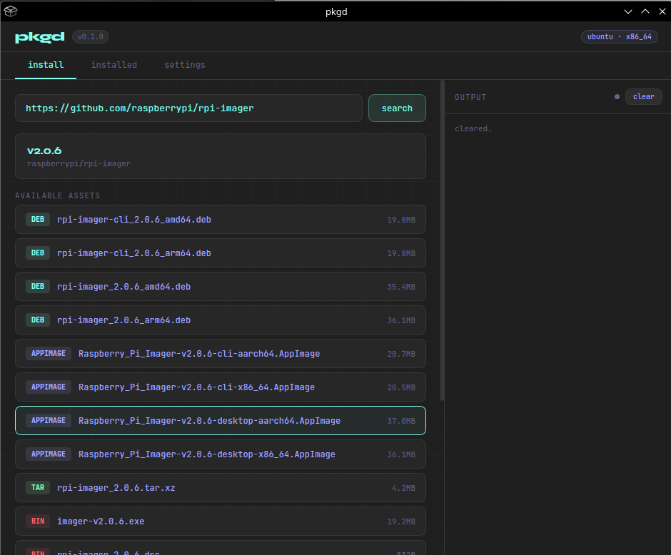

# pkgd
**making linux easier than windows '95**
pull and install unifier · package manager for simplicity · cli or gui — you pick

by [sudoxreboot](https://github.com/sudoxreboot)

---

  

---

## what it is

pkgd is a shell command + gui app that installs software from github releases, package managers, and direct urls — automatically detecting your os/distro/arch and picking the right package. no hunting release pages, no manual wget, no version pinning. one command.

---

## goals

- [x] simple command to install with url or repo
  - [x] bonus: search just the app name (i.e. `pkgd -i balenaEtcher`)
- [x] parse distro you're on
- [x] pull latest or specific version (i.e. `pkgd raspberrypi/rpi-imager`)
- [x] install latest or specific version (i.e. `pkgd -i raspberrypi/rpi-imager`)
- [ ] update
- [x] ~~uninstall~~ remove
- [ ] github asset support
  - [x] .deb
  - [x] .AppImage
  - [ ] .rpm
  - [ ] .tar.gz
  - [ ] .zip
- [ ] package managers confirmed to work
  - [x] apt
  - [ ] aur
  - [ ] zypper
  - [ ] snap
  - [ ] flatpak
  - [ ] nix
  - [ ] portage
  - [ ] docker
  - [ ] docker compose
  - [ ] apk
- [ ] gitlab
- [ ] steam
- [ ] exe upload / proton install
- [ ] unified and uniform

---

## features

- **os-aware** — detects debian/ubuntu/fedora/arch/macos, picks the right package format
- **arch-aware** — handles x86_64, arm64, armhf
- **multi-source** — github, package managers (apt · flatpak · snap · dnf · pacman), direct urls
- **priority-based auto-install** — single ⚡ button picks the best source automatically
- **installed packages** — track, view, update, and remove everything in one place
  - pkgd managed · detected · dependencies · os base packages
- **smart fallback** — if deb fails, falls back to zip/appimage automatically
- **desktop entries** — creates `.desktop` files and refreshes the app cache on install
- **gui** — tauri-based gui with live install log, flyout package controls, update tracking
- **any shell** — standalone bash script, works in zsh/bash/fish

---

## testers wanted — coming soon

we're building something different. pkgd is going live with a gamified beta.

### the scavenger hunt
- [ ] dynamic quest system pulling challenges via github
- [ ] xp/leveling logic tied to system health
- [ ] reward asset system (taco, dino, etc.)

### the healer *(log-parsing)*
- [ ] auto-install missing dependencies from stderr
- [ ] silent repair toggle vs verbose console

### the bridge *(windows → linux)*
- [ ] steam library "skip the store" integration
- [ ] custom .exe proton prefix orchestration

### boss battles
- [ ] wouldn't you like to know?

---

**want to test?**
keep an eye on this repo — a reddit contest is coming with select criteria.
i'll be looking for specific types of testers.

---

## automatic package priority by os

| distro | priority order |
|---|---|
| debian / ubuntu / kubuntu / mint / pop | deb → appimage → tar → zip → bin |
| fedora / rhel / centos / rocky / opensuse | rpm → appimage → tar → zip → bin |
| arch / manjaro / endeavouros | appimage → tar → zip → bin |
| macos | dmg → zip → tar → bin |
| unknown | appimage → tar → zip → bin |

---

## roadmap

- [ ] `pkgd update` — check and update already-installed pkgd-managed apps
- [ ] aur helper integration for arch
- [ ] flatpak ref support
- [ ] gitlab releases
- [ ] steam / proton integration

---

## license

mit — do whatever you want with it.
built by [sudoxreboot](https://github.com/sudoxreboot) | [sudoxreboot.com](https://sudoxreboot.com)
